<p align="center">
  <picture>
    <source media="(max-width: 760px) and (prefers-color-scheme: dark)" srcset="./docs/assets/demo-mobile-dark.svg">
    <source media="(max-width: 760px)" srcset="./docs/assets/demo-mobile-light.svg">
    <source media="(prefers-color-scheme: dark)" srcset="./docs/assets/demo-dark.svg">
    <source media="(prefers-color-scheme: light)" srcset="./docs/assets/demo-light.svg">
    
  </picture>
</p>

<h1 align="center">GitHub Profile Agent Console</h1>

<p align="center">
  Turn a transparent portrait and structured profile data into a responsive, animated GitHub Profile README.
</p>

<p align="center">
  <a href="https://github.com/wildanniam/GitHub-Profile-Console/generate"></a>
</p>

<p align="center">
  
  
  
</p>

This is an opinionated starter kit, not a loose prompt. It provides the layout, portrait renderer, responsive SVG animation, configuration schema, setup wizard, README generator, validation, and optional recent-activity automation.

## Before You Start

You need a GitHub account, [Git](https://git-scm.com/), Node.js 20 or newer, and a head-to-torso PNG with a transparent background. The setup runs locally on macOS, Linux, or Windows.

## What It Creates

- An animated ASCII portrait generated from your transparent PNG.
- Separate desktop/mobile and dark/light SVG assets.
- A professional README with About, Focus, Projects, Research Direction, and Tech Stack sections.
- Hash-based asset filenames so GitHub does not keep an outdated cached image.
- An optional daily activity block that only edits its own markers.
- A private-input workflow: your original portrait is never copied into the repository.

## Quick Start

### 1. Create your GitHub Profile repository

Click **Use this template** above, select **Create a new repository**, and use these settings:

- **Owner:** your personal GitHub account
- **Repository name:** exactly your GitHub username
- **Visibility:** Public

```text
GitHub username: octocat
Repository name: octocat
Repository URL:  github.com/octocat/octocat
```

GitHub only displays a Profile README when the repository owner and repository name match. Do not clone this starter repository directly for your profile; create your own repository from the template first.

### 2. Clone your new repository and install

Clone the profile repository you just created. For example, if your username is `octocat`:

```bash
git clone https://github.com/octocat/octocat.git
cd octocat
npm ci
```

Replace every `octocat` in the example with your own GitHub username. Run the commands from Terminal, PowerShell, or the integrated terminal in your code editor.

### 3. Prepare your portrait

Use a head-to-torso PNG with a transparent background. Keep the source file outside the repository when possible, for example `~/Pictures/profile-transparent.png`. The generator reads it locally and does not copy it into your repository.

### 4. Choose your setup path

**Guided CLI:**

```bash
npm run setup
```

The wizard asks for your public profile information and the absolute path to your portrait, then generates the hero assets and replaces this starter README with your profile README.

**AI coding agent:** after installing the dependencies, open [`PROMPT.md`](./PROMPT.md), attach your portrait path, and ask Codex, Claude Code, or another coding agent to follow it.

### 5. Review the generated profile

```bash
npm run check
git status --short
```

Open the four generated SVG files in `assets/hero/` and check the desktop/mobile variants in both dark and light mode. Confirm that your project links are correct and that the original portrait is not listed by `git status`.

### 6. Publish

```bash
git add README.md profile.config.json assets/hero
git commit -m "feat: create my GitHub profile"
git push origin main
```

Your profile should appear at `https://github.com/YOUR_USERNAME` shortly after the push.

If GitHub asks you to approve workflows created from a template, open the repository's **Actions** tab and enable them. The optional activity workflow only runs when the repository name matches its owner.

For a slower walkthrough, read [Quick Start](./docs/QUICK_START.md).

## Two Ways to Customize

| Path | Best for | What you do |
| --- | --- | --- |
| **Setup wizard** | People who want guided questions | Run `npm run setup` and answer each prompt. |
| **AI agent** | People who want better copy and project curation | Give the agent `PROMPT.md`, your portrait path, and factual profile information. |

Both paths produce the same deterministic assets. The AI agent is used for judgment and writing, not for inventing a different rendering system.

## Commands

| Command | Purpose |
| --- | --- |
| `npm run setup` | Interview you, update configuration, and generate the complete profile. |
| `npm run generate -- --source /path/to/portrait.png` | Regenerate the hero and README from the current configuration. |
| `npm run generate:hero -- --source /path/to/portrait.png` | Regenerate only responsive SVG assets. |
| `npm run generate:readme` | Rebuild README content from configuration and the current asset manifest. |
| `npm run activity -- --dry-run` | Preview recent public GitHub activity without editing README. |
| `npm run check` | Validate configuration, scripts, asset references, and generated SVGs. |

## Configuration

All public profile content lives in [`profile.config.json`](./profile.config.json). The included [`profile.schema.json`](./profile.schema.json) provides editor hints and documents valid values.

```json
{
  "profile": {
    "name": "Your Name",
    "username": "yourusername",
    "headline": "AI Engineer & Product Builder"
  },
  "appearance": {
    "palette": "signal"
  }
}
```

Available palettes are `signal`, `ocean`, and `solar`. See [Customization](./docs/CUSTOMIZATION.md) before changing layout code.

## How Portrait Generation Works

```text
transparent portrait
        ↓
alpha validation and automatic trim
        ↓
grayscale sampling and edge-aware ASCII conversion
        ↓
responsive animated SVGs
        ↓
manifest + generated Profile README
```

The rendering happens locally through [`sharp`](https://sharp.pixelplumbing.com/). No portrait is uploaded to an image service.

## Repository Structure

```text
.
├── profile.config.json       # Public profile content
├── profile.schema.json       # Configuration contract
├── PROMPT.md                 # AI-agent personalization workflow
├── assets/hero/              # Generated SVGs and manifest
├── docs/                     # Instructions preserved after README generation
├── scripts/                  # Setup, rendering, README, activity, validation
└── .github/workflows/        # Validation and optional activity automation
```

## Privacy

The source portrait is intentionally excluded from generated output. Common source filenames and the `input/` directory are ignored by Git. Always inspect `git status` before committing. Read [Privacy](./docs/PRIVACY.md) for the full checklist.

## Troubleshooting

Most issues are caused by a non-transparent image, a repository with the wrong name, overly long hero labels, or old GitHub image cache. Start with [Troubleshooting](./docs/TROUBLESHOOTING.md).

## Credits

Created by [Wildan Syukri Niam](https://github.com/wildanniam). The original design was developed for an AI Researcher and Web3 Builder profile, then rebuilt as a configurable public starter kit.

## License

[MIT](./LICENSE). You can use, modify, and publish your generated profile. A star or attribution is appreciated, but not required.
