<!-- Generated by GitHub Profile Agent Console. Edit profile.config.json, then run npm run generate. -->

  <picture>
    <source media="(max-width: 760px) and (prefers-color-scheme: dark)" srcset="./assets/hero/agent-console-c039734d-mobile-dark.svg">
    <source media="(max-width: 760px)" srcset="./assets/hero/agent-console-c039734d-mobile-light.svg">
    <source media="(prefers-color-scheme: dark)" srcset="./assets/hero/agent-console-c039734d-dark.svg">
    <source media="(prefers-color-scheme: light)" srcset="./assets/hero/agent-console-c039734d-light.svg">
    
  </picture>

  

## About Me

I build practical web applications, automate tasks, and explore cybersecurity concepts.

My work focuses on clean code, system performance, and building tools that solve real-world problems efficiently.

## Current Focus

| Area | What I am exploring |
| --- | --- |
| **Web Development** | Building modern, responsive, and intuitive web interfaces and applications. |
| **Python & Automation** | Writing scripts and tools to automate repetitive tasks and optimize systems. |
| **Cybersecurity Fundamentals** | Exploring penetration testing concepts, system security, and safe software practices. |

## Featured Work

| Project | Focus | Why it matters |
| --- | --- | --- |
| [**Personal Portfolio**](https://github.com/youssef-deve-er/portfolio) | Frontend Development | A clean, responsive web application showcasing projects, technical skills, and background. [Live](https://youssef-deve-er.github.io/portfolio/) |
| [**Python Scripts**](https://github.com/youssef-deve-er) | System Automation | Collection of Python scripts and automation tools built to streamline workflows. |

## Research Direction

I am interested in creating efficient software, understanding security mechanisms, and leveraging automation to streamline developer workflows.

## Tech Stack

`Python` · `HTML5` · `CSS3` · `JavaScript` · `Linux` · `Git` · `VS Code`

## Recent Activity

<!-- AUTO:ACTIVITY:START -->
- Jul 23, 2026: pushed 1 commit to [youssef-deve-er/digital-clock](https://github.com/youssef-deve-er/digital-clock).
- Jul 23, 2026: pushed 1 commit to [youssef-deve-er/weather-app](https://github.com/youssef-deve-er/weather-app).
- Jul 23, 2026: pushed 1 commit to [youssef-deve-er/portfolio](https://github.com/youssef-deve-er/portfolio).
- Jul 23, 2026: pushed 1 commit to [youssef-deve-er/calculator](https://github.com/youssef-deve-er/calculator).
- Jul 23, 2026: created a branch in [youssef-deve-er/calculator](https://github.com/youssef-deve-er/calculator).
- Jul 23, 2026: created a branch in [youssef-deve-er/weather-app](https://github.com/youssef-deve-er/weather-app).
<!-- AUTO:ACTIVITY:END -->

---

  Building practical tools, exploring security, and sharing what works.

